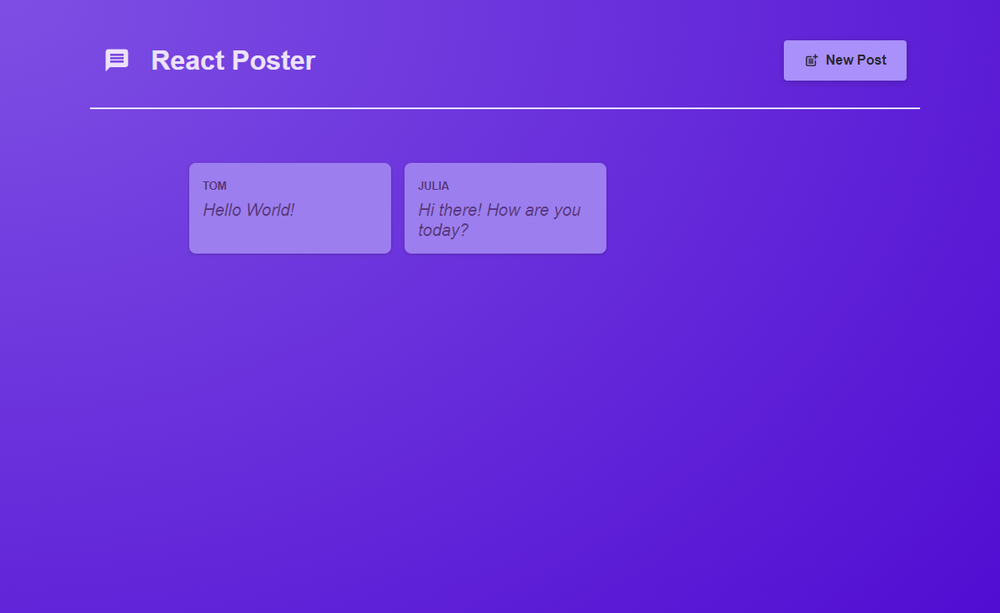
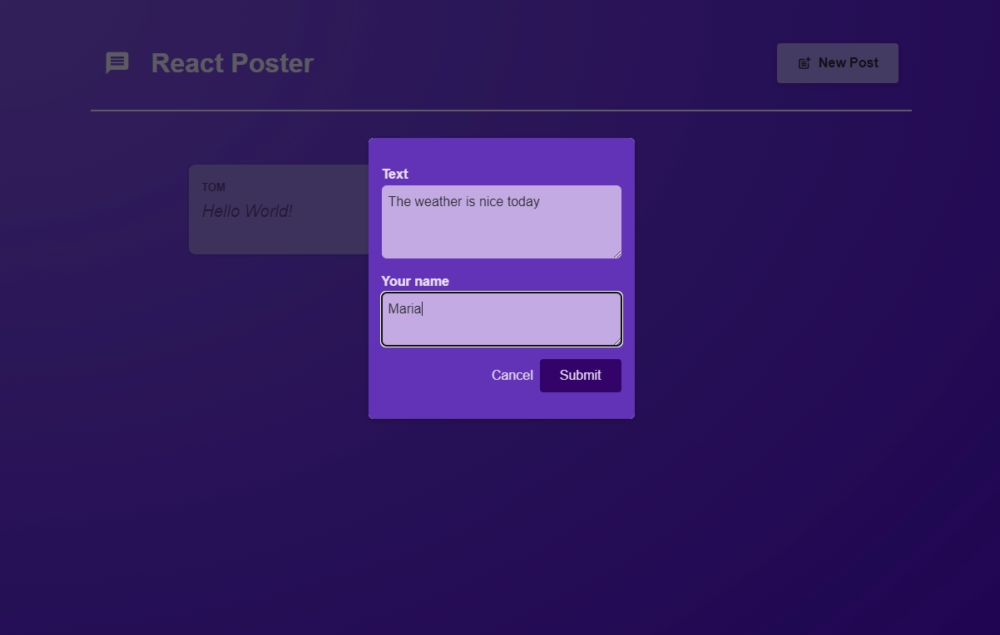

# Posts Board

Simple application for posting

## Table of contents

- [General info](#general-info)
- [Technologies](#technologies)
- [Packages used](#packages-used)
- [Website url](#website-url)
- [Website screenshot](#website-screenshots)

## General info

- it's an application to adding posts on the posting board (with author name and content)
- application is built on react components
- the website was created as part of the react course
- vite was used to initialize the application
- css module was used to style the application
- the application uses react hooks
- to navigate the application was used react router

## Technologies

Project is created with:

- React.js
- React Router
- CSS Modules
- JavaScript
- HTML

## Packages used

- react-icons
- react-router-dom

## Website url

coming soon...

## Website screenshot

### Post board

### Add new post

